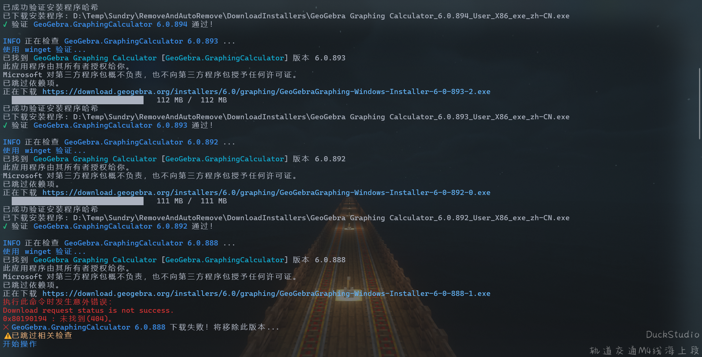
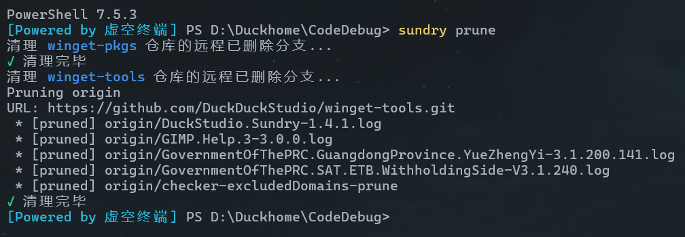
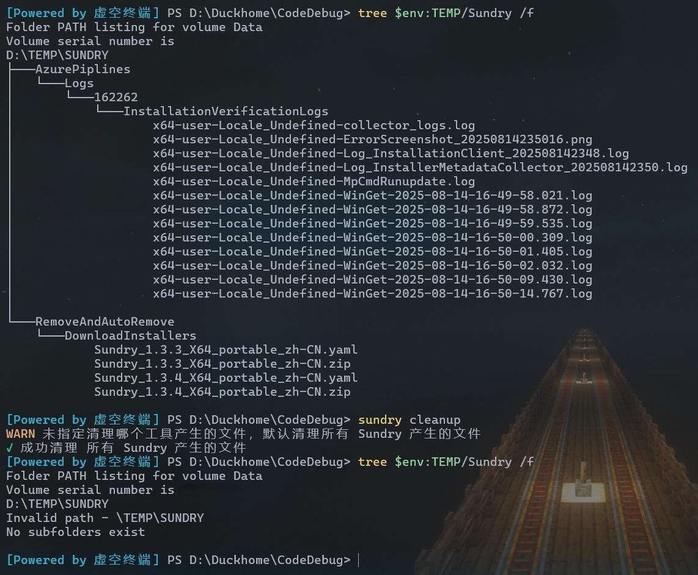

# Sundry

[](https://github.com/DuckDuckStudio/Sundry/releases/latest)   

Sundry 是一个 WinGet 相关的工具，帮您更方便地移除清单、修改清单、分析验证错误等。  

## 如何获取
### Windows
可以前往 [GitHub Release](https://github.com/DuckDuckStudio/Sundry/releases) 页面下载安装程序或 zip/7z 归档。  
或者使用 WinGet 获取:  
```bash
winget install --id DuckStudio.Sundry --source winget --exact
```

### Ubuntu
[从源构建](#ubuntu-1)。  

## 使用说明
当您获取本工具后，请先使用这个命令初始化配置文件:  

```bash
sundry config init
```

> 题外话: 这个配置文件就是我将其从我自己的工具变为这里的工具的方法 XD  
> 参见 [配置文件文档](docs/config/) 了解有关配置文件的更多说明。  

初始化完配置文件后用以下命令确认下:  

```bash
sundry config show
```

如果有任何地方不对，请使用这个命令修改对应键的值:  

```bash
sundry config "<配置项>" "<值>"
```

> 如果你想手动编辑配置文件，请运行 `sundry config edit`。  

## 可用命令

<details>
  <summary><code>sundry help</code></summary>

  

- 别名: 任何非命令字符
- 作用: 显示 Sundry 帮助

</details>


<details>
  <summary><code>sundry ver</code></summary>

  

- 别名: `ver`, `版本`, `version`, `Version`, `--version`, `--ver`, `-v`
- 作用: 显示 Sundry 版本和安装位置

</details>


<details>
  <summary><code>sundry remove</code></summary>

  

> 截图来自拉取请求: https://github.com/microsoft/winget-pkgs/pull/265074  

- 别名: `移除`, `remove`
- 作用: **移除一个指定的包的指定版本**，并在移除前自动检查该版本是否确实存在问题。可以指定理由或跳过自动检查。**默认理由为“安装程序URL在GitHub Action上返回了404”。**
- 用法: `sundry remove <包标识符> <包版本> [是否跳过自动检查] [理由]`
- 示例:
  - 基本: `sundry remove DuckStudio.FufuTools 1.3.10`
  - 跳过自动检查: `sundry remove DuckStudio.FufuTools 1.3.10 True`
  - 指定理由: `sundry remove DuckStudio.FufuTools 1.3.10 "该版本存在一个已知问题"`
  - 指定理由的同时跳过自动检查: `sundry remove DuckStudio.FufuTools 1.3.10 True "该版本存在一个已知问题"`

</details>


<details>
  <summary><code>sundry autoremove</code></summary>

  

- 别名: `自动移除`, `autoremove`
- 作用: 自动检查并移除指定包标识符下的失效版本。
- 用法: `sundry autoremove <包标识符> [是否跳过检查]`
- 示例:
  - 基本: `sundry autoremove DuckStudio.Sundry`
  - 跳过检查 (直接移除整个包): `sundry autoremove DuckStudio.Sundry skip`

</details>


<details>
  <summary><code>sundry modify</code></summary>

  

- 别名: `单改`, `单修改`, `modify`
- 作用: **修改一个指定的包的指定版本的清单**，并在修改完后自动提交拉取请求。
- 用法: `sundry modify <包标识符> <版本> [理由/解决的议题]`
- 示例:
  - 基本: `sundry modify XBMCFoundation.Kodi 18.2.0.0 ` (https://github.com/microsoft/winget-pkgs/pull/267613)
  - 指定理由: `sundry modify XBMCFoundation.Kodi 18.3.0.0 "替换 HTTP 为 HTTPS"` (https://github.com/microsoft/winget-pkgs/pull/267614)
  - 链接议题: `sundry modify DuckStudio.Sundry 1.2.6 "https://github.com/microsoft/winget-pkgs/issues/267539"`
  - 指定理由的同时链接议题: 
    ```pwsh
    sundry modify DuckStudio.Sundry 1.2.6 "一些修改。
    - Resolves https://github.com/microsoft/winget-pkgs/issues/267539"
    ```
    > GitHub Docs: [使用关键词将拉取请求链接到议题](https://docs.github.com/zh/issues/tracking-your-work-with-issues/using-issues/linking-a-pull-request-to-an-issue#linking-a-pull-request-to-an-issue-using-a-keyword)  

</details>


<details>
  <summary><code>sundry logs-analyse</code></summary>

  

- 别名: `日志分析`, `logs-analyse`, `logs_analyse`, `Azure日志分析`
- 作用: **分析 [Azure Validation Pipeline Run](https://duckduckstudio.github.io/Articles/#/信息速查/终端/WinGet/参考信息?id=验证管道日志在哪看？) 失败时的日志，自动查找具体哪里失败了。**
- 用法: `sundry logs-analyse <Azure Pipeline Url> [是否保留日志文件] [是否显示一般信息]`
- 示例:
  > 这里的 Azure Validation Pipeline Run 是 https://github.com/microsoft/winget-pkgs/pull/295511#issuecomment-3315258870 的。
  - 基本: `sundry logs-analyse "https://dev.azure.com/shine-oss/8b78618a-7973-49d8-9174-4360829d979b/_build/results?buildId=183216"` (需要用户输入)
  - 不保留日志文件: `sundry logs-analyse "https://dev.azure.com/shine-oss/8b78618a-7973-49d8-9174-4360829d979b/_build/results?buildId=183216" n`
  - 保留日志文件: `sundry logs-analyse "https://dev.azure.com/shine-oss/8b78618a-7973-49d8-9174-4360829d979b/_build/results?buildId=183216" y` (运行后将打开日志文件所在目录)
  - 不显示一般信息: 默认，不需要传递额外参数。
  - 显示一般信息: `sundry logs-analyse "https://dev.azure.com/shine-oss/8b78618a-7973-49d8-9174-4360829d979b/_build/results?buildId=183216" 占位 y`
  - 保留日志文件且不显示一般信息: 默认不显示一般信息，同保留日志文件的示例。
  - 保留日志文件且显示一般信息: `sundry logs-analyse "https://dev.azure.com/shine-oss/8b78618a-7973-49d8-9174-4360829d979b/_build/results?buildId=183216" y y`

> 下载日志文件时响应 404 意味着什么？

1. 验证管道没有上传日志。
2. 此次运行的日志已被删除。  
  如果这是一个较早的运行，日志可能已经被项目配置自动清理掉了。

Sundry 会尝试分析下载成功的日志，跳过下载失败的日志。  

> 分析结果前面的标识是什么意思？

| 标识 | 是什么 | 什么时候应该看 |
|-----|-----|-----|
| Screenshot | 验证管道提供的错误截图 | Validation-Unattended-Failed |
| Analysis | 一般日志信息 | Validation-Installation-Error、Validation-Shell-Execute 等安装过程中遇到的问题 |
| ExeRunInfo | 验证管道的工件 `ValidationResult.zip` 中的 `InstallationVerification_Result.json` 中有关可执行文件运行的信息 | Validation-Executable-Error |

> 日志分析结果 (Analysis) 的颜色代表什么？

| 颜色 | 啥意思 |
|-----|-----|
| 黄色 | 很大可能是你的 PR 遇到的问题 |
| 红色 | 一些其他可能的问题 |
| 默认颜色 | 一般信息，默认不显示 |

> [!WARNING]  
> `sundry logs-analyse cleanup` 已被 `sundry cleanup logs-analyse` 取代，前者计划在未来的 Sundry 中移除。  

</details>

<details>
  <summary><code>sundry verify</code></summary>

  

> 截图是在 Hyper-V Windows 10 x64 虚拟机上的测试。  
> 虽然他们已经换成了 Windows 11 虚拟机，不过我觉得也没啥差别，Sundry 也可以在 Windows 11 虚拟机上使用。  

- 别名: `verify`, `验证`
- 作用: **用于测试本地或 PR 上的清单的安装和卸载，并获取 ARP 条目变更。**
- 用法:
  - 本地仓库清单: `sundry verify <包标识符> <包版本>`
  - 指定清单文件夹: `sundry verify <清单文件夹路径>`
  - PR 清单: `sundry verify <PR链接>`
- 示例:
  - 测试本地仓库清单: `sundry verify DuckStudio.FufuTools 1.3.10`
  - 测试指定清单文件夹: `sundry verify D:/WinGet/Manifests/d/DuckStudio/FufuTools/1.3.10/`
  - 测试 PR 清单: `sundry verify <PR链接>`

> [!NOTE]
> 1. **它只能获取 HEAD 分支没被删除的 PR 的清单**，如果 HEAD 分支被删除了，GitHub API 会响应 404 Not Found。  
> 2. 它暂时**无法获取 `UpgradeCode`**。  

</details>

<details>
  <summary><code>sundry ignore</code></summary>

  

- 别名: `忽略`, `检查忽略`, `ignore`
- 作用: **管理 [winget-tools](https://github.com/DuckDuckStudio/winget-tools/) 中的检测脚本的忽略字段。**
- 用法: `sundry ignore <add/remove/edit/list> [忽略字段] [理由]`
- 示例:
  - 添加忽略字段: `sundry ignore add "https://www.argyllcms.com/" "服务器冲不动咖啡 (418)"`
  - 移除忽略字段: `sundry ignore remove "https://www.argyllcms.com/" "又冲得动了"`
  - 编辑忽略字段: `sundry ignore edit`
  - 列出所有忽略字段: `sundry ignore list`

> [!WARNING]  
> 该命令计划在未来的 Sundry 中移除。  

</details>


<details>
  <summary><code>sundry cat</code></summary>

  

- 别名: 没有别名，只能用 `cat`。
- 作用: **获取指定包标识符的指定版本的清单**，可以指定获取所有清单或某个类型的清单。
- 用法: `sundry cat <包标识符> <版本> [清单类型] [区域设置(如果是locale类型)]`
- 示例:
  - 获取所有清单: `sundry cat DuckStudio.Sundry 1.2.3`
    - 亦可使用 `sundry cat DuckStudio.Sundry 1.2.3 all`
    - 除 `all` 外还可用 `全部`, `所有`
  - 获取指定类型的清单:
    - 安装程序清单: `sundry cat DuckStudio.Sundry 1.2.3 i`
      - 可以用 `installer`, `安装程序`, `安装`, `i`
    - 区域清单: `sundry cat DuckStudio.Sundry 1.2.3 l zh-CN`
      - 可以用 `locale`, `区域`, `区域设置`, `l`
      - 必须指定具体哪个区域设置的清单
    - 版本清单: `sundry cat DuckStudio.Sundry 1.2.3 v`
      - 可以用 `version`, `ver`, `v`, `版本`

</details>


<details>
  <summary><code>sundry prune</code></summary>

  

- 别名: 没有别名，只能用 `prune`。
- 作用: **清理仓库远程已删除的分支。**
  - 等效于:  
    ```bash
    cd $winget_pkgs
    git remote prune origin
    cd $winget_tools
    git remote prune origin
    ```
- 用法: `sundry prune`
- 示例: `sundry prune`

</details>


<details>
  <summary><code>sundry sync</code></summary>

  

- 别名: `sync`, `同步`, `synchronize`, `sync-fork`
- 作用: **同步 fork 仓库和上游仓库的修改。**
- 用法: `sundry sync`
- 示例: `sundry sync`

</details>


<details>
  <summary><code>sundry repr</code></summary>

  

- 别名: 没有别名，只能用 `repr`。
- 作用: 等效于 Python 的 `repr()`，用于获取字符串真实的样子。
- 用法: `sundry repr <文件路径/文本内容> [编码(默认 UTF-8)]`
- 示例:
  - 文本:
    ```pwsh
    sundry repr "第一行
    第二行"
    ```
  - 文件: `sundry repr "D:/文件路径/文件.txt"`
  - 指定编码: `sundry repr "D:/文件路径/文件.txt" "gbk"`

</details>


<details>
  <summary><code>sundry config</code></summary>

  

- 别名: `config`, `配置`
- 作用: 管理 Sundry 配置。
- 用法: `sundry config <参数...>`
- 示例:
  - 初始化配置文件: `sundry config init`
  - 显示当前配置: `sundry config show`
  - 编辑配置文件: `sundry config edit`
  - 修改配置项: `sundry config git.signature false`
  - 更新配置文件: `sundry config update` (当然你直接重新 `init` 一份也可以)

> 有关配置文件的更多信息，请参阅[配置文件文档](docs/config/README.md)。

</details>


<details>
  <summary><code>sundry revert</code></summary>

  

- 别名: `还原`, `revert`
- 作用: **还原本地仓库的修改**，如果 Sundry 在修改的某个过程中崩溃了，则可以使用此命令还原 Sundry 做的修改。
- 用法: `sundry revert <仓库> <是否已提交> <是否丢弃>`
- 示例:
  - 还原所有仓库、未提交、丢弃: `sundry revert all n y`
  - 还原 winget-pkgs 仓库、已提交、丢弃: `sundry revert pkgs y y`
  - 还原 winget-tools 仓库、未提交、保留: `sundry revert tools n n`

</details>


<details>
  <summary><code>sundry fun</code></summary>

  

- 别名: 没有别名，只能用 `fun`。
- 作用: **管理 Sundry 的 `fun.txt`。**
- 用法: `sundry fun <random/list/edit/add/remove/import> [参数...]`
- 示例:
  - 随机一个: `sundry fun` 或 `sundry fun random`
    - 还可以使用 `sundry fun 随机`
  - 列出所有: `sundry fun list`
    - 可以用 `获取`, `读取`, `get`, `list`
  - 编辑 fun.txt: `sundry fun edit`
    - 可以用 `编辑`, `edit`, `打开`, `open`
  - 添加新的: `sundry fun add "提问: 罗浮六御中谁最幸福? 答案: 符玄。因为她姓符。"`
    - 可以用 `add`, `添加`
  - 移除原来的: `sundry fun remove "Ciallo～(∠・ω< )⌒☆"`
    - 可以用 `remove`, `移除`
  - 从其他文件导入(覆盖): `sundry import "D:/文件路径/另一个fun.txt"`
    - 可以用 `import`, `导入`

</details>


<details>
  <summary><code>sundry cleanup</code></summary>

  

- 别名: `清理`, `cleanup`, `clean`
- 作用: **清理 Sundry 的各个工具运行时产生的文件。**
- 用法: `sundry cleanup <工具名>`
  - 除了工具名外，您还可以使用 `all` / `aec` 这些特殊标识来清理某部分的文件。有关这些特殊标识的说明请见下方的示例。
- 示例:
  - 清理所有: `sundry cleanup all`
  - 清理除缓存外所有: `sundry cleanup` (等效于 `sundry cleanup aec`)
  - 清理指定工具: `sundry cleanup logs-analyse`

</details>

### Ubuntu 支持

| 命令 | 是否支持 | 备注 |
|-----|-----|-----|
| help | ✓ |  |
| ver | ✓ |  |
| remove | ✕ | 验证阶段需要 WinGet，不确定如何读取 Token |
| autoremove | ✕ | 验证阶段需要 WinGet，移除版本依赖 remove 命令 |
| modify | ✕ | 验证清单需要 WinGet，不确定如何读取 Token |
| logs-analyse | 部分支持 | 不支持自动打开日志文件夹 |
| verify | ✕ | 您只能在 Windows 上验证包 |
| ignore | ✕ | 不确定如何读取 Token |
| cat | ✓ |  |
| sync | ✓ |  |
| prune | ✓ |  |
| repr | ✓ |  |
| config | ✓ |  |
| revert | ✓ |  |
| fun | ✓ |  |
| cleanup | ✓ |  |

## 自己构建
### Windows

> [!TIP]
> 仓库下有一个适用于 Windows 的[构建流](https://github.com/DuckDuckStudio/Sundry/blob/main/.github/workflows/build.yaml)，你可以 fork 后直接运行，它会将结果上传为工件。  

1. 克隆后 `cd` 到项目所在目录
2. 更新代码中的版本号
```pwsh
python "自动化脚本/修改版本号.py" "2025.520.1314"
```
3. 安装依赖
```pwsh
python -m venv .venv
& ".venv\Scripts\Activate.ps1"
python.exe -m pip install --upgrade pip
pip install -r "requirements.txt"
```
4. 转换图标格式 (可选)
```pwsh
python "自动化脚本/png-2-ico.py"
```
5. 构建
```pwsh
pyinstaller --onefile --distpath="Release" --name="sundry.exe" "src/sundry.py" --icon "icon/Sundry.ico"
# 如果前面没转换图标格式，参数中的图标请用 icon/Sundry.png，Pyinstaller 会尝试自己转换格式。
```
6. 复制所需文件
```pwsh
Copy-Item -Path "src/fun.txt" -Destination "Release" -Verbose
Copy-Item -Path "LICENSE" -Destination "Release" -Verbose
```
7. `Release` 下就是构建结果

### Ubuntu
```bash
set -e
echo "克隆源码..."
git clone https://github.com/DuckDuckStudio/Sundry.git
cd Sundry
echo "创建虚拟环境并安装依赖..."
python3 -m venv .venv
source .venv/bin/activate
pip install -r "requirements.txt"
echo "构建二进制文件..."
python3 "自动化脚本/修改版本号.py" "2025.520.1314"
pyinstaller --onefile --distpath="Release" --name="sundry" "src/sundry.py"
deactivate
cp -v "src/fun.txt" "Release"
cp -v "LICENSE" "Release"
echo "整理文件..."
cd ..
cp -rv "Sundry/Release" "./Release"
rm -rvf Sundry
cd Release
echo "配置 Sundry..."
./sundry ver
./sundry config init
```

然后 `./Release` 下就是构建结果。  

